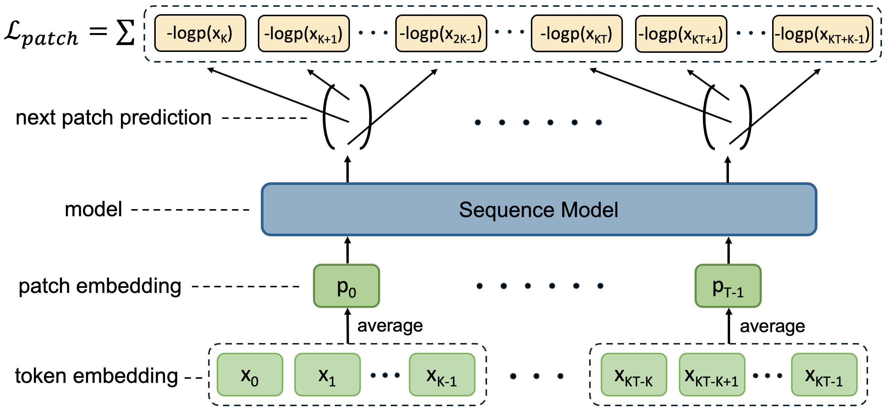
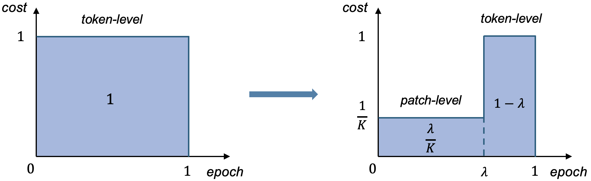
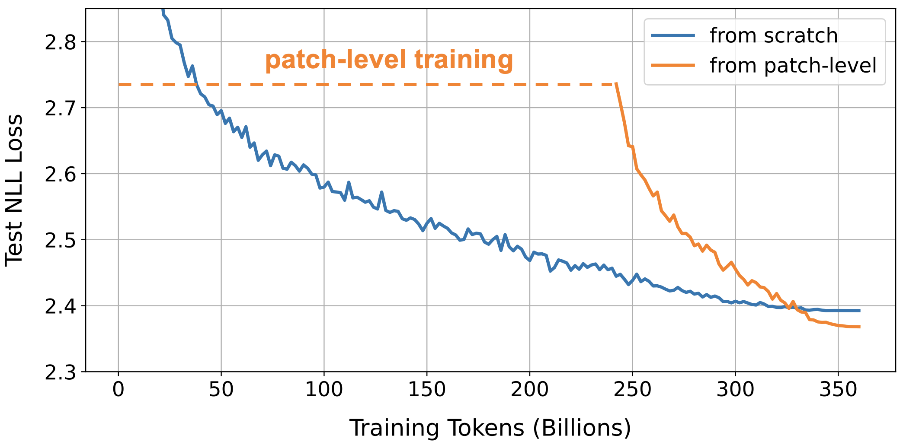
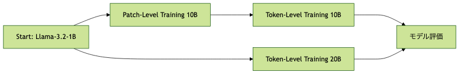
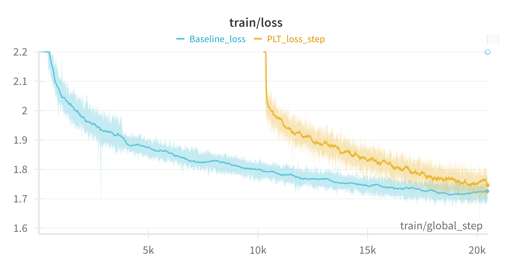
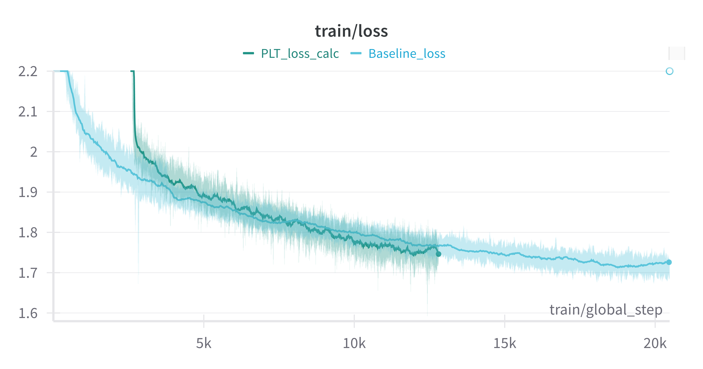
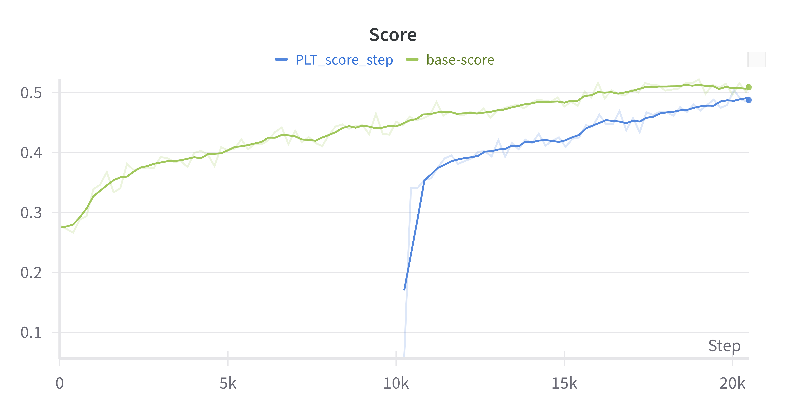
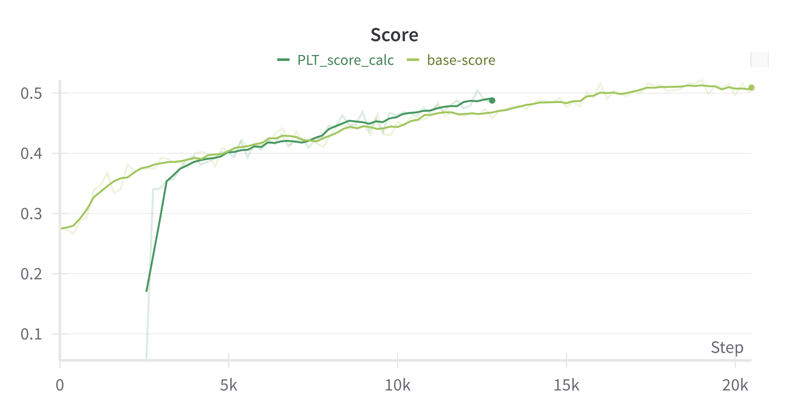

<!-- スライド1：タイトル -->
# 「Patch-Level TrainingでLLMの継続事前学習を効率化できるか？」
#### *「LLMの継続事前学習でPatch-Level Trainingを試し、その有用性を検証してみた話」*

---

<!-- スライド2：背景 & 課題 -->
# 「LLMの事前学習、計算コストの問題」
- 従来の事前学習は、LLMの規模拡大に伴い計算コストが非常に高い
- 継続事前学習は、既存モデルの知識更新や新データへの適応を 低コストで実現する対策として注目
- 例として **Llama 3.3 Swallow** が挙げられる
- 継続事前学習によってコスト削減はされているが、 依然としてコストが高い

---

<!-- スライド3：Patch-Level Trainingの概要 -->
# 「Patch-Level Trainingの概要」

  

    <ul>
      <li><strong>Patch-Level Training (PLT)</strong> 複数トークンを1つの<b>パッチ</b>にまとめて学習する手法</li>
      <li>通常のLLMは1トークンずつ 学習（Token-Level Training）</li>
      <li>同じ計算量でより多くの データを処理可能</li>
      <li>情報損失を抑えつつ、 学習コスト削減を狙う</li>
    </ul>
  

  

    
  

---

<!-- スライド4：Patch-Level Trainingのコスト削減 -->
# 「Patch-Level Trainingのコスト削減」

  

    <ul>
      <li><strong>理論式</strong>： コスト削減 ＝ λ/K + (1−λ)</li>
      <li>λ: PLT割合, K: パッチサイズ</li>
      <li>λを大きくするとパッチ部分が増加 → コスト削減率は上がるが 情報損失のリスクも増す</li>
    </ul>
  

  

    
  

---

<!-- スライド5：Patch-Level Trainingの学習フロー -->
# 「Patch-Level Trainingの学習フロー」

  

    <ul>
      <li><strong>from scratch</strong> (青線) と <strong>from patch-level</strong> (オレンジ線) の比較例</li>
      <li><strong>TLT開始時の損失</strong>が高いが、その後の学習によって徐々に差は縮小し、同等以上の性能を出す</li>
    </ul>
  

  

    
  

---
# Patch-Level Training Figure 1

---
# Patch-Level Training Figure 2

---
<!-- スライド6：実験設定 -->
# 「実験設定」
- **元モデル:** meta-llama/Llama-3.2-1B  
- **比較:**  
  - PLTを使用したモデル  
  - Token-Level TrainingのみのBaselineモデル  
- **設定:**  
  - patch_size = 4  
  - λ = 1/2（途中でλ=2/3も検証可能）  
- **データ:** kajuma/ABEJA-CC-JA-edu（約20Bトークン）

---

<!-- スライド7：評価指標と実験フロー -->
# 「評価指標と実験フロー」
- **評価指標:**
  - 学習損失  
  - pfgen-benchmark 平均スコア  
- **実験フロー:**

---

<!-- スライド8：学習損失 同じstep数 vs 同じ計算量 -->
# 「実験結果：学習損失」
- **同じstep数での比較**: Token-Level Training移行後、Baselineとの差は徐々に縮まるが最終的には追いつかず
- **同じ計算量での比較**: PLTのスコアがBaselineに近づく、あるいは上回る傾向が見られる

  

    
  

  

    
  

---

<!-- スライド9：pfgen-benchmark 同じstep数 vs 同じ計算量 -->
# 「実験結果：pfgen-benchmark」
- **同じstep数での比較**: Token-Level Training移行後、Baselineとの差は徐々に縮まるものの最終的には追いつかず
- **同じ計算量での比較**: PLTのスコアがBaselineに近づく、あるいは上回る傾向が見られる

  

    
  

  

    
  

---

<!-- スライド10：考察 -->
# 「なぜこの結果になったのか？」
- PLTでパッチの生成を学習することによるモデルの重みが 破壊されている可能性
- Token-Level Trainingへの移行で損失は回復するが、学習を延長しても完全には追いつかない  
- λを1/4など小さくすると改善の余地はあるが、学習コスト削減効果は低下するため慎重に検討が必要
- 下流タスクでの性能比較が必要

---

<!-- スライド11：まとめ -->
# 「結論：PLTは現時点では最適解ではない」
- PLTは学習コスト削減のメリットがあるが… λを下げなければ精度が低い λを下げると、学習コスト削減効果も薄れる → PLT選択のメリットは十分に得られない
- **結論:現時点で継続事前学習において積極的にPLTを選択すべきでない**
